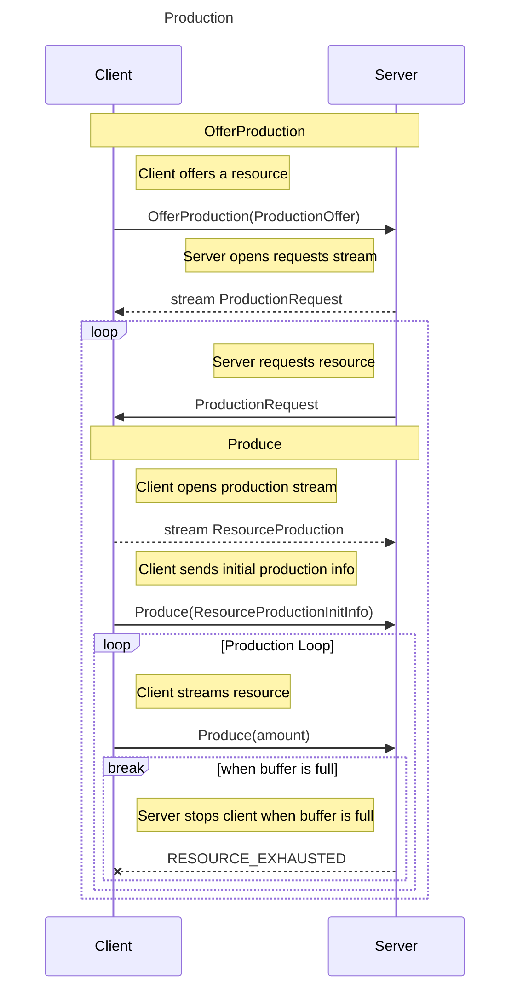
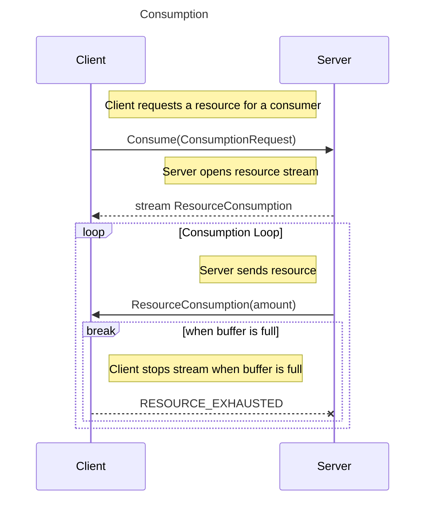

# Communication

The communication between clients and the server is handled using **gRPC**,
enabling efficient, bidirectional streaming and request-response interactions.

The actual proto file can be found [here](../virdi/grpc_service/protos/virdi.proto)

### **What’s Covered in This Section?**
- **Overview of gRPC Services**: Explanation of how clients and the server communicate.
- **RPC Definitions**: Detailed breakdown of each service method.
- **Message Structures**: Explanation of the data exchanged between clients and the server.
- **Interaction Flows**: Diagrams illustrating the production and consumption processes.

This section serves as a reference for developers integrating with the system, providing insights into how resources are managed between clients and the server.

## Production



---

### OfferProduction

Clients use this RPC to offer a resource for production.
Opened once for each offered resource.

- The server registers the client as a possible producer.
- The server sends requests whenever it needs the resource.

**RPC Definition:**

```proto
rpc OfferProduction (ProductionOffer) returns (stream ProductionRequest);
```

**Flow:**

1. Client sends `ProductionOffer` to the server.
2. Server registers the client and opens a `ProductionRequest` stream.
3. Server sends `ProductionRequest` messages when it needs the offered resources.

---

### Produce

Clients use this RPC to stream resources to the server.
Opened once for each produced resource.

- The server requests production through the `ProductionRequest` stream in `OfferProduction`.
- The client continuously sends resources
- The server cancels the stream with `RESOURCE_EXHAUSTED` when its buffer is full.

**RPC Definition:**

```proto
rpc Produce (stream ResourceProduction) returns (ProductionResponse);
```

**Flow:**

1. Client sends an initial `ResourceProductionInitInfo`.
2. Client continuously sends `amount` updates.
3. Server aborts with `RESOURCE_EXHAUSTED` when the buffer is full.

---

## Consumption



---

### Consume

Clients use this RPC to request resources for a consumer.
Opened once for each consumer.

- Multiple streams can be opened for different resources and consumers.
- The server streams resources as long as available.
- The server cancels the stream with `RESOURCE_EXHAUSTED` when its buffer is full.

**RPC Definition:**

```proto
rpc Consume (ConsumptionRequest) returns (stream ResourceConsumption);
```

**Flow:**

1. Client requests a resource using `ConsumptionRequest`.
2. Server streams `ResourceConsumption` messages.
3. Client processes the resource until the buffer is full.
4. Client cancels the stream with `RESOURCE_EXHAUSTED`.

---

## Message Definitions

### ProductionOffer

```proto
message ProductionOffer {
  string resource_id = 1;
}
```

**Description:**
Sent by the client in `OfferProduction` to indicate which resource it can produce.

| Field         | Type     | Description                         |
|---------------|----------|-------------------------------------|
| `resource_id` | `string` | Identifier of the resource offered. |

---

### ProductionRequest

```proto
message ProductionRequest {
}
```

**Description:**
Sent by the server in response to `OfferProduction` to request production.

| Field     | Type | Description                                                              |
|-----------|------|--------------------------------------------------------------------------|
| *(empty)* | -    | The meere presence of this message signals that production is requested. |

---

### ResourceProduction

```proto
message ResourceProduction {
  oneof payload {
    ResourceProductionInitInfo init_info = 1;
    uint32 amount = 2;
  }
}
```

**Description:**
Sent by the client in `Produce` to either initialize production or send resource amounts.

| Field       | Type                         | Description                    |
|-------------|------------------------------|--------------------------------|
| `init_info` | `ResourceProductionInitInfo` | Initial production metadata.   |
| `amount`    | `uint32`                     | Amount of resource being sent. |

---

### ResourceProductionInitInfo

```proto
message ResourceProductionInitInfo {
  string resource_id = 1;
}
```

**Description:**
Sent as the first message in `Produce` to specify the resource being produced.

| Field         | Type     | Description                                |
|---------------|----------|--------------------------------------------|
| `resource_id` | `string` | Identifier of the resource being produced. |

---

### ProductionResponse

```proto
message ProductionResponse {
}
```

**Description:**
Sent by the server in response to `Produce` to acknowledge production.
Usually not sent as the server aborts the connection when full.

| Field     | Type | Description                                     |
|-----------|------|-------------------------------------------------|
| *(empty)* | -    | Acknowledges the receipt of produced resources. |

---

### ConsumptionRequest

```proto
message ConsumptionRequest {
  string consumer_id = 1;
  string resource_id = 2;
  uint32 max_rate = 3;
  uint32 buffer_limit = 4;
  uint32 current_buffer_amount = 5;
}
```

**Description:**
Sent by the client in `Consume` to request a resource.

| Field                   | Type     | Description                                                                   |
|-------------------------|----------|-------------------------------------------------------------------------------|
| `consumer_id`           | `string` | Identifier of the consumer requesting the resource.                           |
| `resource_id`           | `string` | Identifier of the resource being requested.                                   |
| `max_rate`              | `uint32` | Maximum rate (units per minute) at which the client can receive the resource. |
| `current_buffer_amount` | `uint32` | (optional) Current amount of resource in the buffer (default: `0`).           |
| `buffer_limit`          | `uint32` | (optional) Maximum buffer size for resource storage (default: `max_rate`).    |

---

### ResourceConsumption

```proto
message ResourceConsumption {
  uint32 amount = 2;
}
```

**Description:**
Sent by the server in `Consume` to provide a resource to the client.

| Field    | Type     | Description                        |
|----------|----------|------------------------------------|
| `amount` | `uint32` | The amount of resource being sent. |

---